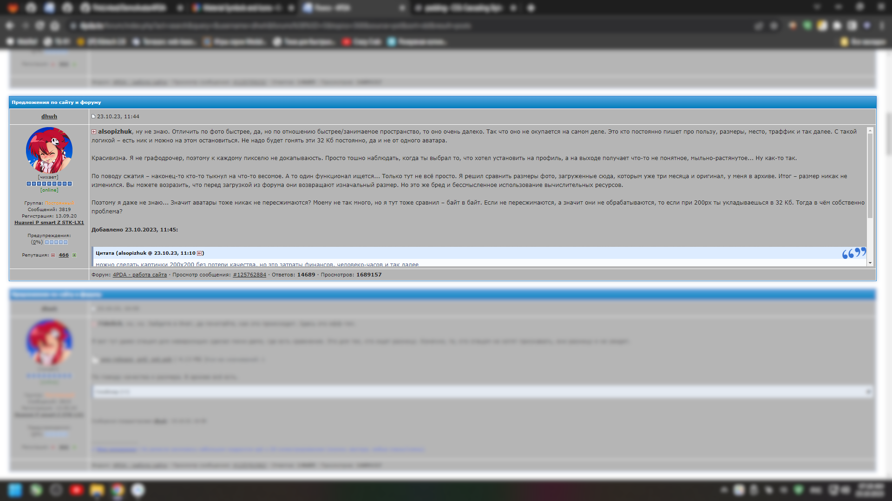

# Что это?

Это я углубился и сделал сранение в приложении, чтобы доказать, что увеличение размера загружаемого аватара со 100 до 200 пропорциональных пикселей даст нормальное отображение, чем то текущее гребаное мыло.

Да, кто-то скажет, что при 200px будет сложнее уложиться в лимит 36 Кб, который установлен на момент начала обсуждения. Но нет, спешу обрадовать... или опечалить? Я взял [оптимизатор изображений на «I Love IMG»](https://www.iloveimg.com/compress-image) и прогнал 200px через него. Я не выбирал сервисы, просто про этот я уже знал. А теперь смотрите **Compare.zip**, который в корне проекта, что вышло. Итог – при желании в 32 Кб влезть можно спокойно.

Кто скажет, что это может повлиять на пересжатие и общую оптимизацию – просто мой бывший пост прочтите:
<details><summary>Screenshot</summary>

</details>

Ну и вердикт. Как уже заметно по статусу поста – его удалили. В общем, пришёл кто-то из администрации... и просто удалил всё обсуждение меня и остальных об этом. Да, просто взял и снёс к ебеням, даже не вникая. Просто оставил ответ одного чела, который сослался на смежный пост со словами, что походу будет аналогичный ответ. И он был прав.

В общем, не понятно, на кой хер нужен этот топик с предложениями, когда администрация в нём отзывает тупо все предложения подряд, отговаривая – то не так, а вот этого не будет, это запарно, тут мне вообще в падло это делать. Вот по такому канону в основном ответы.

Ну и в конце осталось это приложение и архив. Решил не выкидывать, а оставить его тут. В приложении можно заметить разницу между размерами. Само приложения, раз уж я его сюда выкладываю, решил нормально оформить. Заодно немного размял свои кости на клавиатуре.

# Лицензия
```
Оригинального текста слишком много. Читаем файл "LICENSE", который в корне проекта.
```
